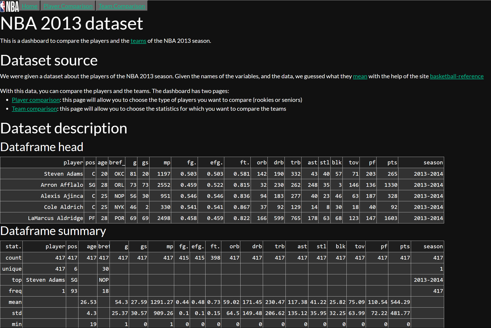
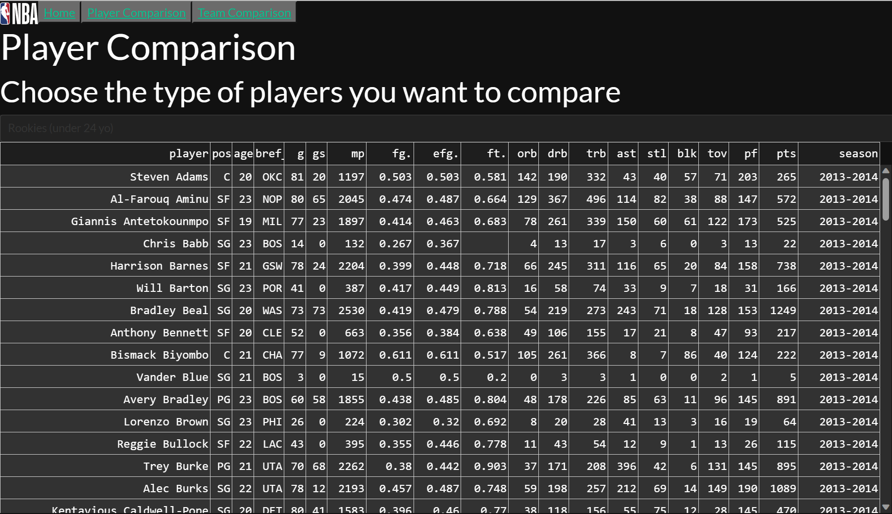
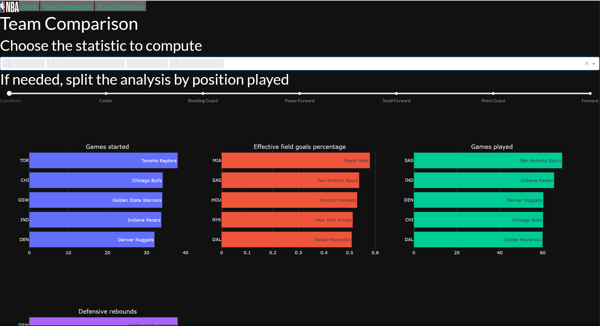

Use of dash and plotly to create an interactive dashboard for the NBA 2013 season.
The home page describes the data and the dashboard. 

The players page shows the
details of each player. 

The teams page shows, for choosen statistics, the top 5 teams.

The code is on github: https://github.com/emericit/dash

A Docker image is available on docker hub: https://hub.docker.com/repository/docker/amerigo07/dash-datascientest/

It has been deployed on Azure at the following address: https://emeric.azurewebsites.net/